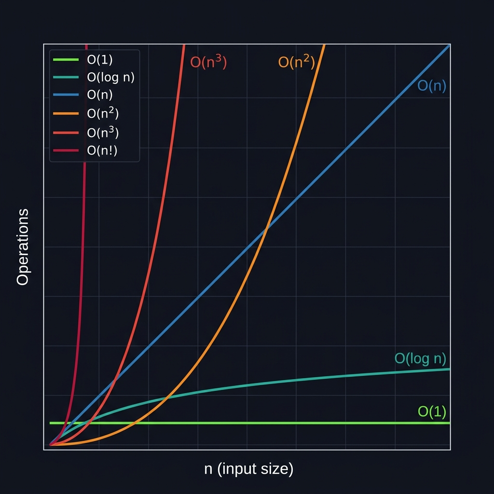

# Алгоритм – сложность

<table>
<tr>
<td valign="top" width="300">

* **O(1)** — константная
* **O(log n)** — логарифмическая
* **O(n)** — линейная
* **O(n²)** — квадратичная
* **O(n³)** — кубическая
* **O(n!)** — факториальная

</td>
<td>

</td>
</tr>
</table>
